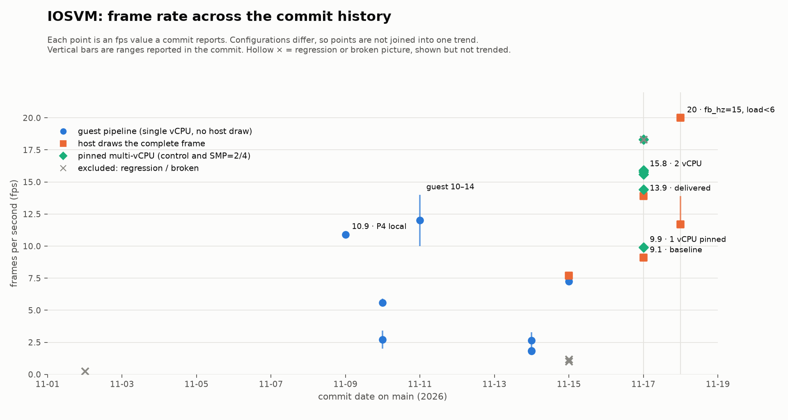
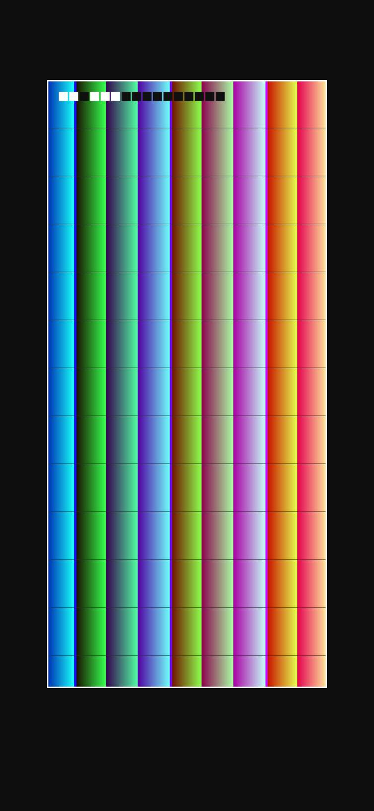

<div align="center">

# IOSVM

**iOS, booting in QEMU on Linux — and operable from a web browser.**
**在 Linux 上的 QEMU 中启动 iOS，并可通过网页浏览器操作。**

[]()
[]()
[]()
[]()
[](LICENSE)


<sub>All three are the panel of a machine booted by this project: Control Center (backdrop blur and
all), Settings, and Screen Time — the last two reached by **clicking in a browser**.<br/>
以上三张均为本项目启动的虚拟机屏幕：控制中心（含背景模糊）、设置、屏幕使用时间——后两者通过**浏览器点击**进入。</sub>

<br/>

[**English**](#english) · [**中文**](#中文)

</div>

---

<a id="english"></a>

# English

## Contents

- [What this is](#what-this-is)
- [Milestones](#milestones)
- [What works today](#what-works-today)
- [Quick start](#quick-start)
- [Drawing the frame on the host](#drawing-the-frame-on-the-host-stages-2324)
- [Multi-core: an open problem](#multi-core-an-open-problem-stage-27)
- [How it came to boot](#how-it-came-to-boot)
- [Repository layout](#repository-layout)
- [What this is not](#what-this-is-not)
- [Documentation](#documentation)
- [License](#license)

## What this is

A Darwin/XNU port that boots Apple's **iOS 16.5 user space** in QEMU on ordinary Linux, draws its
system UI, and lets you drive it from the host: taps, swipes and the software keyboard, through a QMP
control channel and a small web/VNC bridge that this repository carries.

The point is the loop, not the screenshot:

```
    your browser ──► webvnc.py ──► QMP ──► virtio-tablet ──► Darwin's touch driver
         ▲                                                        │
         │                                                        ▼
    JPEG frames ◄── screendump ◄── ramfb ◄── IOMobileFramebuffer ◄── CoreAnimation
                                                       ▲
                                        Mesa softpipe ─┘  (a CPU rasteriser, hence the frame rate)
```

The second, faster loop — the host does the drawing, the guest only records it:

```
    guest CoreAnimation ──GL records──► host_glwire ──► real GL (a V100 here)
                                             │
                                             └──► JPEG stream ──► browser, clicks back over QMP
```

## Milestones

Dates are commit dates on `main`. The repository has about 700 commits from 2026-10-31 to 2026-11-18.

| Date | Milestone | Commit |
|---|---|---|
| 2026-10-31 | **M0** — the kernel is built on Linux from source and boots | `4101663` |
| 2026-10-31 | The user space boots: launchd, backboardd, SpringBoard | `9d3babb` |
| 2026-10-31 | **First pixels** — our own program lights the panel | `d41c95a` |
| 2026-10-31 | The system UI draws through Mesa softpipe (boot logo) | `3d054a8` |
| 2026-10-31 | **Home screen** — SpringBoard's UI on the panel | `5b0cfd3` |
| 2026-10-31 | **Operated from the host** — tapping Settings opens it; three levels deep to Screen Time | `f4fb4e9`, `c300753` |
| 2026-11-01 | **Operated from a browser**, including typing without a keyboard service | `16b5712`, `e4d7579` |
| 2026-11-01 | Host-side GL replay begins: the guest records GL calls and the host draws the panel | `0a3e128` |
| 2026-11-02 | A NULL-pixel fix carries the remote path to the home screen | `fb4e9fa` |
| 2026-11-03 | Stage 9 — boot stability: with the lock deadlines raised, 8 of 8 cold boots show no panic | `3bf05e0` |
| 2026-11-07 | **First real glyphs** on the screen through the host replay | `cecbd2e` |
| 2026-11-15 | virtio-gpu works end to end, but measured **zero** frame-rate gain — the transport is not the bottleneck | `b7fdef5` |
| 2026-11-17 | **Complete frame drawn on the host: 13.9 fps, 75 ms a frame** (the delivered setting, one vCPU) | `82190eb` |
| 2026-11-17 | Two pinned vCPUs: 15.8 fps median; a 30-minute run with 0 panics (later revisited, see below) | `cc33526` |
| 2026-11-18 | Stage 26 — `fb_hz=15` cuts CPU per frame from 69 ms to 51 ms with an identical picture | `cc17734`, `730e0f7` |
| 2026-11-18 | Stage 27 — multi-core reopened as a must-solve item; single-threaded TCG runs SMP=2 for 30 minutes with no panic, which points at parallel vCPUs | `b5bd190`, `6df855c` |
| 2026-11-22 | Stage 29 (experiment branch) — a Metal client's commands are recorded in the guest, translated to Vulkan on the host and shown in a browser: 2,000/2,000 frames byte-exact, 58.3 fps median for the synthetic 750×1624 client; CoreAnimation still draws through GL | [`experiment/metal-translation`](docs/stage29-metal-translation.md) |

## Performance over time



The development dashboard, and how it is regenerated:


- `python3 docs/charts/make_chart.py` redraws `docs/charts/fps-history.png` from the measured runs.
- `python3 docs/charts/dashboard.py` redraws `docs/charts/dashboard.png`.

## What works today

| | state | evidence |
|---|---|---|
| boot to the home screen | **yes**, ~8 minutes, about 40 % of attempts (the rest stall inside the port) | [home screen](docs/demo/home-screen.png) |
| tap an icon, launch an application | **yes** | [Settings](docs/demo/settings-app.png) |
| navigate inside an application | **yes** | [Screen Time](docs/demo/screen-time-from-host.png) |
| swipe (home gesture, pull down) | **yes** | [Control Center](docs/demo/control-center.png) |
| operate it from the host | **yes** — QMP, `tools/qemu/tap.py` | [addendum 28](docs/research/linux-kernel-build.md) |
| operate it from a browser | **yes** — `tools/qemu/webvnc.py` | [Focus, by browser click](docs/demo/webvnc-focus-page.png) |
| type text | **yes**, as taps on the software keyboard | [typing `abc`](docs/demo/webvnc-typed-abc.png) |
| networking to the host (LAN) | **yes** — `en0` 10.0.2.15, HTTP both ways | [addendum 30](docs/research/linux-kernel-build.md) |
| names, DNS | no — configd's plugin never registers here | addendum 30 |
| GPU acceleration | no — a CPU rasteriser is what this machine has | — |
| animation smoothness | ~4–7 fps on the CPU rasteriser; **13.9 fps with the host drawing the frame** (one vCPU, the delivered setting); two pinned vCPUs reach ~15.9 fps but are not yet stable — [open problem](#multi-core-an-open-problem-stage-27) | [stage 25](docs/stage25-multicore.md), [stage 27](docs/stage27-multicore.md) |
| complete frame, drawn on the host | **yes** — the guest's CoreAnimation calls are replayed on the host's GL, the result is what you see | [stage 23 verdict](docs/stage23-verdict.md) |
| Metal calls translated to the host's Vulkan (experiment, separate branch) | **partly** — a Metal client's blit/present is recorded in the guest, executed on the host's Vulkan GPU (device 1) and served in a browser; CoreAnimation is **not** on Metal yet (no renderer library / AIR compiler) | [stage 29](docs/stage29-metal-translation.md) |
| watch that frame in a browser | **yes** — `tools/glwire/webview.py`, JPEG stream + clicks back through QMP | `tools/glwire/webview.html` |

`docs/state-of-the-port.md` is the one-page handover view of the same table.

## Quick start

Nothing in this repository is Apple's. You supply an IPSW you obtained yourself.

```sh
git clone --recursive https://github.com/lshan99q/iosvm.git
cd iosvm

# 1. Bring your own IPSW — nothing of Apple's is in this repository
tools/unpack-ipsw.sh ~/iPhone10,3,iPhone10,6_16.5_20F66_Restore.ipsw

# 2. Build the kernel, the images and the loader (see docs/ for the pieces)
make

# 3. Boot, and wait until something is actually drawn (it retries: not every boot lands)
tools/qemu/wait-for-ui.sh /tmp/home.png

# 4. Operate it — from a browser…
tools/qemu/qmpmux.py --qmp 4445 --port 4465
tools/qemu/webvnc.py --port 5980 --qmp 4465      # then http://127.0.0.1:5980/
#    …or from a shell
tools/qemu/tap.py 683 1689                      # the Settings icon

# 5. Or let the host draw the frame: boot with the guest replaying only, then watch that frame
#    (the guest's own panel stays half-empty — see "Drawing the frame on the host" below)
GLWIRE_NO_PANEL=1 GLWIRE_STATIC_PATCH=1 \
  GLWIRE_STATIC_PATCH_FILE=/tmp/patch-full.bgra GLWIRE_SHM=/dev/shm/glwire-frame \
  tools/glwire/host_glwire &                   # the replay, publishing each frame
python3 tools/glwire/webview.py --port 6083 --crop 1624   # then http://127.0.0.1:6083/
```

The tools in `tools/qemu/` are the ones this project actually uses:

| tool | does |
|---|---|
| `wait-for-ui.sh` | boots, retries until a screen is drawn; `KEEP=1` leaves the machine running |
| `tap.py` | a tap or a swipe at panel coordinates, over QMP |
| `qmpmux.py` | QEMU serves one QMP client; this serves many |
| `webvnc.py` | the browser viewer: frames out, clicks and keys in |
| `vncbridge.py` | the same for a VNC viewer instead of a browser |
| `demo.sh` | the whole sequence in one command, a picture of every step |

## Drawing the frame on the host (stages 23–24)

The CPU rasteriser is the ceiling, so the next step was to stop asking it to draw: the guest records
its CoreAnimation GL calls, ships them over a socket, and the host replays them on a real GL device.
The frame the host composites is the one to look at.

| | measured |
|---|---|
| host replay, complete picture | **13.9 fps** on one vCPU (the delivered setting; picture byte-identical to the baseline). Two pinned vCPUs reach ~15.9 fps (stage 25) but have panicked on a scheduler lock in stage 27 — see below |
| the host's own cost per frame | ~41 ms before `gkbf=1`; **~1.4 ms** with it (records 90 KB → 4–19 KB a frame) — never the bottleneck |
| the guest's frame budget | was 117.1 ms = CA 71.0 + encode/copy 46.8 + wait 1 µs; the "CA 71 ms" turned out to be the display driver's **full-panel upscale blit** (750×1624 → 1125×2436, 2.74 M pixels): 62 ms/swap, now skipped (`fb_noblit=1`) |

Measured 2026-11-17: with `gkbf=1 glwire_ack_only=1 fb_noblit=1` the guest spends 75 ms a frame and the
picture is byte-identical to the 9.09 fps baseline. The wall-clock figure moves ±30% with host load, so
compare paired runs, never single shots. See [stage 24 blit](docs/stage24-blitfast.md) and
[the gkbf negative result](docs/stage24-gkbf.md).

Two consequences worth writing down, because both look like they should work and do not:

- **the guest is not waiting for the host.** `wait = 1 µs`, so asynchronous replies and double
  buffering buy nothing.
- **the records are tiny.** 12.65 KB per frame, 0.26 % of the 4.87 MB picture; de-duplicating them
  saves under 0.12 ms. The 46.8 ms is a 4.9 MB round trip, not encoding.

`virtio-gpu` (stage 23) is implemented end to end — control queue, 2D resource, scanout, transfer,
flush — and measured **zero** frame-rate gain (1.80 → 1.85 fps, inside the noise): the transport was
never the bottleneck. It stays as the groundwork for a 3D path, not as a speed-up.

## Multi-core: an open problem (stage 27)

Multi-core is **not ruled out** — it is the largest measured speed-up available, and it is being
worked on as a must-solve item. Pinning helps; it has not yet made the configuration reliable.

| configuration (same host load) | median fps | result |
|---|---|---|
| 1 vCPU, pinned | 9.9 | baseline |
| 2 vCPUs, pinned to two host cores | 15.6–15.9 | +58–60 %; stage 25 ran 30 min with 0 panics, stage 27 reproduced scheduler-lock panics |
| 4 vCPUs, pinned | 14.4 | no gain: total CPU per frame nearly doubles (MTTCG overhead and lock contention) |
| 2 vCPUs, not pinned | — | Ticket spinlock panic within 5 frames |
| 2 vCPUs, `thread=single` (T1), 30 min | no panic | the deadlock needs parallel vCPUs (hypothesis H-A) |

Stage 27 (2026-11-18) records five pinned two-vCPU runs: two ran 30 minutes without a panic, three
crashed within 5–10 minutes, all on the scheduler processor-set lock (`_pset0`). Loosening the
ticket-lock timeout 4× did not help, which points at a lock holder that stops releasing rather than a
short host preemption. The first test (T1) ran with `thread=single` and passed 30 minutes with no panic,
which supports hypothesis H-A: the failure needs vCPUs running in parallel. The rest of the test
matrix (`tb-size`, CPU model, a panic-time dump of every CPU, host isolation) is in
[stage 27](docs/stage27-multicore.md). Until those tests pass, the delivered setting stays one vCPU.

## Metal translation (experiment, stage 29)

A separate branch, [`experiment/metal-translation`](docs/stage29-metal-translation.md), asks the
other half of [ADR-002](docs/adr/ADR-002-api-translation.md): instead of replaying CoreAnimation's
GL records, replace the guest's Metal device and translate at the API level. It is an experiment,
not a delivered path — the Replay path above is untouched and remains the baseline.

What it shows: the port's own `IOAcceleratorES` + `MetalPluginName` discovery path loads a Metal
device bundle we wrote; a Metal client in the guest can make a device, a queue, a buffer, a texture
and a blit+present; the command buffer is recorded at `commit` and executed on the host's Vulkan
device (the second V100, slot 1); the picture is read back, CRC-checked and published into the same
shared memory `tools/glwire/webview.py` serves, so a translated frame is visible in a browser:



| | measured (2026-11-21/22, one vCPU, GPU 1, synthetic 750×1624 client) |
|---|---|
| frames / correctness | 5 × 400 frames, 2,000 / 2,000 `crc_ok=1`, full `memcmp` of source vs read-back identical, 0 panics |
| fps | median **58.3** (57.4–60.1) |
| guest, per frame | picture fill 2.6 ms, Metal calls 0.19 ms, commit 7.1 ms, wait 13.7 ms |
| host, per frame | 4.2 ms (GPU copy 0.94 ms, read-back + sampled checksum 0.31 ms, publish 2.9 ms) |
| wire | 0 picture bytes on the socket: the host reads the pixels from guest RAM (`hakios_vtop`, as the Replay path does) |
| transport, before/after | **1.94 fps** with the 4.87 MB picture inline on the socket, **58.3 fps** median with the by-reference upload — the transport, not the translation, was the cost |


What it does **not** show: a CoreAnimation frame. This port's window server does not take a Metal
path (its renderer library is missing and, behind it, an AIR→SPIR-V compiler), so the translated
client is a synthetic Metal program painted by the test, and its 58.3 fps must not be compared with
the delivered 13.9 fps as if it were the same workload. The honest comparison, the dead ends and
the self-corrections are in [stage 29](docs/stage29-metal-translation.md); the decision is
[ADR-013](docs/adr/ADR-013-metal-translation.md); the research note is
[the feasibility report](docs/research/metal-translation-feasibility.md).

How to run it (the branch owns the tooling; nothing here changes main's build):

```sh
make metalwire-host                              # the Vulkan translator (no guest needed)
make metalwire-test                              # its CI-safe test on lavapipe
HAKIOS=<hakios checkout> make metalwire-guest     # guest bundle + client (needs the iPhoneOS SDK)
HAKIOS=<hakios checkout> make metalwire-worktree  # private run tree (sudo once; ~90 MB)
tools/metalwire/prepare-guest.sh translate        # root image with the Metal client
tools/metalwire/run-guest.sh translate 300        # boot it (instance 3, ports 4474/4475)
```

It uses GPU 1 and ports 9111/9210/4474/4475 on purpose, so it can run beside another experiment on
the same host; the delivered Replay path (GPU 0, port 9110) is never touched.

## How it came to boot

Three things had to be true, and the research note records the measurement behind each:

1. **the display must have a show service** — on a phone the GPU driver starts it; in QEMU nothing
   did, so user-space painting had nowhere to land (`patches/0001`);
2. **`fb_beat` must be 0** — the driver's on-the-beat pacing drops every frame after the first when
   rendering is this slow, which is exactly the "boots to a logo and stops" symptom;
3. **something must send the touch** — a launchd job of ours is not reliably executed here, so the
   synthetic touches come from `/etc/rc`, which `init` runs before it hands process 1 to launchd.

The long version — with the dead ends and three self-corrections —
is [`docs/research/linux-kernel-build.md`](docs/research/linux-kernel-build.md).

## Repository layout

| path | what |
|---|---|
| `patches/` | the changes made to the port: one patch per finding, with the reason |
| `tools/qemu/` | the boot-and-operate tooling above |
| `tools/glwire/` | the guest's GL wire protocol: `host_glwire.c` (the replay), `webview.py` (that frame in a browser) |
| `host/metalwire/`, `guest/metal-plugin/` | the Metal→Vulkan experiment: the host Vulkan translator and the guest Metal device bundle (stage 29, branch `experiment/metal-translation`) |
| `tools/metalwire/` | the experiment's own run tree, root-image preparation and measurement harness |
| `tools/apfs/` | reading and writing the images without Apple's tools |
| `guest/` | programs that run inside the machine (the painter, `netcfg`) |
| `proto/`, `host/vkbridge/` | GPU transport and its host-side Vulkan backend (submodules) |
| `docs/` | ADRs, the research note, the state of the port, demo screenshots |

## What this is not

- **Not Apple's software.** No kernel, no system image, no dyld cache, no firmware, no font lives
  here. You supply an IPSW you obtained yourself; see `PROVENANCE.md`. Three rules are vetoes: no
  Apple binaries in the tree, no impersonating a device to Apple's servers, no credentials.
- **Not a jailbreak.** The port's own kernel is lenient about code signing by construction (AMFI is a
  stand-in that accepts any parseable signature); nothing here attacks a real device.
- **Not fast.** The renderer is a CPU rasteriser. With the host drawing the frame the 11 fps target is
  met (13.9 fps / 75 ms a frame, 2026-11-17); the old 9.09 fps figure is kept in the stage-24 docs as the
  baseline it is compared against. 24 fps is a target, not a claim: it needs a real 3D path or
  same-architecture virtualisation.

## Documentation

| | |
|---|---|
| [`docs/state-of-the-port.md`](docs/state-of-the-port.md) | one page: what works, what does not |
| [`docs/stage25-multicore.md`](docs/stage25-multicore.md) | the first pinned two-vCPU measurements |
| [`docs/stage27-multicore.md`](docs/stage27-multicore.md) | the multi-core problem: hypotheses, test matrix, acceptance |
| [`docs/research/linux-kernel-build.md`](docs/research/linux-kernel-build.md) | the long note: every measurement, and the mistakes |
| [`docs/stage29-metal-translation.md`](docs/stage29-metal-translation.md) | the Metal→Vulkan experiment: what was measured, and what it does not prove |
| [`docs/research/metal-translation-feasibility.md`](docs/research/metal-translation-feasibility.md) | the M1 note: where Metal can be intercepted, why CA is not on it, which translator exists |
| [`docs/adr/ADR-013-metal-translation.md`](docs/adr/ADR-013-metal-translation.md) | the decision: device plug-in, commit-level translation, by-reference transport, host Vulkan |
| [`docs/architecture.md`](docs/architecture.md) | how the pieces fit |
| [`docs/phases.md`](docs/phases.md) | milestones, one acceptance command each |
| [`docs/adr/`](docs/adr) | the decisions, with their evidence |
| [`docs/zh/`](docs/zh) | Chinese translations |

## License

MIT for this project's code (`LICENSE`); Apple's open-source XNU keeps its APSL
(`LICENSE.APSL`), and the GPL-2.0 parts (`LICENSE.GPL2`) stay GPL-2.0. See `NOTICE`.

<p align="right"><a href="#iosvm">↑ back to top / 返回顶部</a></p>

---

<a id="中文"></a>

# 中文

## 目录

- [项目简介](#项目简介)
- [里程碑](#里程碑)
- [当前能力](#当前能力)
- [快速开始](#快速开始)
- [宿主绘制画面（第 23–24 阶段）](#宿主绘制画面第-2324-阶段)
- [多核：未解决的问题](#多核未解决的问题第-27-阶段)
- [启动是怎么实现的](#启动是怎么实现的)
- [仓库结构](#仓库结构)
- [本项目不是什么](#本项目不是什么)
- [文档](#文档)
- [许可证](#许可证)

## 项目简介

这是一个 Darwin/XNU 移植。它在普通 Linux 上的 QEMU 中启动 Apple 的 **iOS 16.5 用户空间**，绘制系统界面，并允许从宿主机操作：点击、滑动和软键盘输入，通过 QMP 控制通道以及本仓库自带的一个小型网页/VNC 桥接器实现。

重点在于这个闭环，而不是截图：

```
    浏览器 ──► webvnc.py ──► QMP ──► virtio-tablet ──► Darwin 触摸驱动
      ▲                                                        │
      │                                                        ▼
    JPEG 帧 ◄── screendump ◄── ramfb ◄── IOMobileFramebuffer ◄── CoreAnimation
                                                       ▲
                                        Mesa softpipe ─┘  （CPU 软光栅，因此帧率较低）
```

第二条更快的闭环：由宿主机负责绘制，客人机只负责记录：

```
    客人机 CoreAnimation ──GL 记录──► host_glwire ──► 真实 GL（此处为 V100）
                                           │
                                           └──► JPEG 流 ──► 浏览器，点击经 QMP 回传
```

## 里程碑

日期为 `main` 分支上的提交日期。仓库从 2026-10-31 到 2026-11-18 共约 700 个提交。

| 日期 | 里程碑 | 提交 |
|---|---|---|
| 2026-10-31 | **M0**——内核在 Linux 上从源码构建并启动 | `4101663` |
| 2026-10-31 | 用户空间启动：launchd、backboardd、SpringBoard | `9d3babb` |
| 2026-10-31 | **第一批像素**——我们自己的程序点亮了屏幕 | `d41c95a` |
| 2026-10-31 | 系统界面通过 Mesa softpipe 绘制（启动图标） | `3d054a8` |
| 2026-10-31 | **主屏幕**——SpringBoard 的界面出现在屏幕上 | `5b0cfd3` |
| 2026-10-31 | **从宿主机操作**——点击设置即可打开；三层深入到屏幕使用时间 | `f4fb4e9`、`c300753` |
| 2026-11-01 | **从浏览器操作**，包括无需键盘服务的文字输入 | `16b5712`、`e4d7579` |
| 2026-11-01 | 宿主侧 GL 回放开始：客人机记录 GL 调用，宿主机绘制屏幕 | `0a3e128` |
| 2026-11-02 | 修复 NULL 像素问题，远程路径可以到达主屏幕 | `fb4e9fa` |
| 2026-11-03 | 第 9 阶段——启动稳定性：提高锁超时后，8 次冷启动均无 panic | `3bf05e0` |
| 2026-11-07 | 通过宿主回放在屏幕上出现**第一批真实字形** | `cecbd2e` |
| 2026-11-15 | virtio-gpu 端到端可用，但实测帧率**零提升**——传输层不是瓶颈 | `b7fdef5` |
| 2026-11-17 | **宿主绘制完整画面：13.9 fps，每帧 75 ms**（交付配置，单 vCPU） | `82190eb` |
| 2026-11-17 | 双 vCPU 绑核：中位 15.8 fps；30 分钟运行 0 次 panic（后被重新审视，见下文） | `cc33526` |
| 2026-11-18 | 第 26 阶段——`fb_hz=15` 使每帧 CPU 从 69 ms 降至 51 ms，画面完全一致 | `cc17734`、`730e0f7` |
| 2026-11-18 | 第 27 阶段——多核重新列为必须解决的问题；单线程 TCG 下 SMP=2 运行 30 分钟无 panic，指向并行 vCPU | `b5bd190`、`6df855c` |
| 2026-11-22 | 第 29 阶段（实验分支）——客人机 Metal 客户端的命令被翻译为宿主 Vulkan 并显示在浏览器中：2000/2000 帧逐字节一致，合成 750×1624 客户端中位 58.3 fps；CoreAnimation 仍走 GL | [`experiment/metal-translation`](docs/stage29-metal-translation.md) |

## 当前能力

| | 状态 | 证据 |
|---|---|---|
| 启动到主屏幕 | **是**，约 8 分钟，约 40% 的尝试成功（其余在移植内部卡住） | [主屏幕](docs/demo/home-screen.png) |
| 点击图标，启动应用 | **是** | [设置](docs/demo/settings-app.png) |
| 在应用内导航 | **是** | [屏幕使用时间](docs/demo/screen-time-from-host.png) |
| 滑动（主屏手势、下拉） | **是** | [控制中心](docs/demo/control-center.png) |
| 从宿主机操作 | **是**——QMP，`tools/qemu/tap.py` | [附录 28](docs/research/linux-kernel-build.md) |
| 从浏览器操作 | **是**——`tools/qemu/webvnc.py` | [浏览器点击聚焦](docs/demo/webvnc-focus-page.png) |
| 输入文字 | **是**，通过软键盘点击实现 | [输入 `abc`](docs/demo/webvnc-typed-abc.png) |
| 与宿主机的网络（局域网） | **是**——`en0` 为 10.0.2.15，双向 HTTP 可达 | [附录 30](docs/research/linux-kernel-build.md) |
| 域名、DNS | 否——configd 插件在此从未注册 | 附录 30 |
| GPU 加速 | 否——本机只有 CPU 软光栅 | — |
| 动画流畅度 | CPU 软光栅约 4–7 fps；**宿主绘制时 13.9 fps**（单 vCPU，交付配置）；双 vCPU 绑核约 15.9 fps，但尚不稳定——见[开放问题](#多核未解决的问题第-27-阶段) | [第 25 阶段](docs/stage25-multicore.md)、[第 27 阶段](docs/stage27-multicore.md) |
| 宿主绘制完整画面 | **是**——客人机的 CoreAnimation 调用在宿主 GL 上回放，所见即结果 | [第 23 阶段结论](docs/stage23-verdict.md) |
| Metal 调用翻译到宿主 Vulkan（实验，独立分支） | **部分**——客人机 Metal 客户端的 blit/present 被记录、在宿主 Vulkan GPU（1 号卡）上执行并在浏览器中可见；CoreAnimation 尚未走 Metal（缺渲染库与 AIR 编译器） | [第 29 阶段](docs/stage29-metal-translation.md) |
| 在浏览器中观看该画面 | **是**——`tools/glwire/webview.py`，JPEG 流，点击经 QMP 回传 | `tools/glwire/webview.html` |

`docs/state-of-the-port.md` 是同一张表的一页式交接视图。

## 快速开始

本仓库中不包含任何 Apple 的软件，你需要自行获取 IPSW。

```sh
git clone --recursive https://github.com/lshan99q/iosvm.git
cd iosvm

# 1. 自备 IPSW——本仓库中不包含任何 Apple 文件
tools/unpack-ipsw.sh ~/iPhone10,3,iPhone10,6_16.5_20F66_Restore.ipsw

# 2. 构建内核、镜像和加载器（各部分说明见 docs/）
make

# 3. 启动，并等待屏幕确实绘制出内容（会自动重试：并非每次启动都成功）
tools/qemu/wait-for-ui.sh /tmp/home.png

# 4. 操作——通过浏览器……
tools/qemu/qmpmux.py --qmp 4445 --port 4465
tools/qemu/webvnc.py --port 5980 --qmp 4465      # 然后访问 http://127.0.0.1:5980/
#    ……或在命令行中
tools/qemu/tap.py 683 1689                      # 点击设置图标

# 5. 或者由宿主机绘制画面：客人机只做回放启动，然后观看该画面
#    （客人机自己的面板会保持半空——见下文"宿主绘制画面"）
GLWIRE_NO_PANEL=1 GLWIRE_STATIC_PATCH=1 \
  GLWIRE_STATIC_PATCH_FILE=/tmp/patch-full.bgra GLWIRE_SHM=/dev/shm/glwire-frame \
  tools/glwire/host_glwire &                   # 回放进程，逐帧发布
python3 tools/glwire/webview.py --port 6083 --crop 1624   # 然后访问 http://127.0.0.1:6083/
```

`tools/qemu/` 中的工具是本项目实际使用的工具：

| 工具 | 作用 |
|---|---|
| `wait-for-ui.sh` | 启动并重试，直到屏幕绘制出内容；`KEEP=1` 保持虚拟机运行 |
| `tap.py` | 在面板坐标处点击或滑动，经 QMP 发送 |
| `qmpmux.py` | QEMU 只允许一个 QMP 客户端连接；它允许多个 |
| `webvnc.py` | 浏览器查看器：输出画面，输入点击和按键 |
| `vncbridge.py` | 相同功能，面向 VNC 查看器而非浏览器 |
| `demo.sh` | 一条命令完成整个流程，每一步都保存截图 |

## 宿主绘制画面（第 23–24 阶段）

CPU 软光栅是性能上限，因此下一步是不再让它绘制：客人机记录 CoreAnimation 的 GL 调用，通过 socket 发送，由宿主机在真实的 GL 设备上回放。应该观察的是宿主机合成出的画面。

| | 实测 |
|---|---|
| 宿主回放，完整画面 | 单 vCPU **13.9 fps**（交付配置；画面与基线逐字节一致）。双 vCPU 绑核可达约 15.9 fps（第 25 阶段），但在第 27 阶段出现调度器锁 panic——见下文 |
| 宿主每帧自身开销 | `gkbf=1` 之前约 41 ms；开启后 **约 1.4 ms**（每帧记录从 90 KB 降至 4–19 KB）——从来不是瓶颈 |
| 客人机的帧预算 | 原为 117.1 ms = CA 71.0 + 编码/拷贝 46.8 + 等待 1 µs；所谓"CA 71 ms"实际是显示驱动的**全面板放大 blit**（750×1624 → 1125×2436，274 万像素）：每次交换 62 ms，现已跳过（`fb_noblit=1`） |

2026-11-17 实测：使用 `gkbf=1 glwire_ack_only=1 fb_noblit=1` 时，客人机每帧耗时 75 ms，画面与 9.09 fps 基线逐字节一致。挂钟时间受宿主负载影响约 ±30%，因此应比较成对运行，而不是单次数据。详见[第 24 阶段 blit](docs/stage24-blitfast.md) 和 [gkbf 负面结果](docs/stage24-gkbf.md)。

有两点值得记录，因为两者看起来应该有效，实际上并无效果：

- **客人机并不等待宿主。** `wait = 1 µs`，因此异步应答和双缓冲毫无收益。
- **记录本身很小。** 每帧 12.65 KB，仅占 4.87 MB 画面的 0.26%；去重最多节省 0.12 ms。那 46.8 ms 是 4.9 MB 的往返传输，而非编码。

`virtio-gpu`（第 23 阶段）已端到端实现——控制队列、2D 资源、scanout、传输、刷新——但实测帧率**零提升**（1.80 → 1.85 fps，在误差范围内）：传输层从来不是瓶颈。它作为未来 3D 路径的基础保留，而不是加速手段。

## 多核：未解决的问题（第 27 阶段）

多核**并未被排除**——它是目前可测得的最大加速空间，正作为必须解决的问题推进。绑核有帮助，但尚未使配置变得可靠。

| 配置（同一宿主负载） | 中位帧率 | 结果 |
|---|---|---|
| 1 vCPU，绑核 | 9.9 | 基线 |
| 2 vCPU，绑定到两个宿主核心 | 15.6–15.9 | 提升 +58–60%；第 25 阶段 30 分钟 0 次 panic，第 27 阶段重现了调度器锁 panic |
| 4 vCPU，绑核 | 14.4 | 无收益：每帧总 CPU 几乎翻倍（MTTCG 开销与锁竞争） |
| 2 vCPU，不绑核 | — | 5 帧内 Ticket spinlock panic |
| 2 vCPU，`thread=single`（T1），30 分钟 | 无 panic | 死锁需要并行 vCPU（假设 H-A） |

第 27 阶段（2026-11-18）记录了 5 次双 vCPU 绑核运行：2 次运行 30 分钟无 panic，3 次在 5–10 分钟内崩溃，全部发生在调度器 processor-set 锁（`_pset0`）上。将票据锁超时放宽 4 倍无效，这说明更可能是持锁者停止释放锁，而非宿主短暂抢占。第一项测试（T1）使用 `thread=single`，运行 30 分钟无 panic，支持假设 H-A：故障需要 vCPU 并行运行。测试矩阵的其余部分（`tb-size`、CPU 型号、panic 时转储所有 CPU、宿主机隔离）见[第 27 阶段文档](docs/stage27-multicore.md)。在这些测试通过之前，交付配置仍为单 vCPU。

## Metal 转译（实验，第 29 阶段）

独立分支 [`experiment/metal-translation`](docs/stage29-metal-translation.md) 探索
[ADR-002](docs/adr/ADR-002-api-translation.md) 的另一半：不再回放 CoreAnimation 的 GL 记录，而是替换客人机的
Metal 设备、在 API 层翻译。这是实验路径，不是交付路径——上面的 Replay 路径原样保留，仍是基线。

它验证了：移植自带的 `IOAcceleratorES` + `MetalPluginName` 发现链能加载我们写的 Metal 设备 bundle；客人机里的
Metal 客户端可以创建设备、队列、buffer、texture 并完成 blit+present；命令缓冲在 `commit` 时被记录、在宿主
Vulkan 设备（第二块 V100，1 号卡）上执行；画面被读回、CRC 校验并写入与 `tools/glwire/webview.py` 相同的共享
内存，因此转译后的画面能在浏览器中看到：


| | 实测（2026-11-21/22，单 vCPU，1 号卡，合成 750×1624 客户端） |
|---|---|
| 帧数 / 正确性 | 5 × 400 帧，2000/2000 `crc_ok=1`，源数据与读回数据完整 `memcmp` 一致，0 次 panic |
| 帧率 | 中位 **58.3**（57.4–60.1） |
| 客人机每帧 | 生成画面 2.6 ms、Metal 调用 0.19 ms、commit 7.1 ms、wait 13.7 ms |
| 宿主每帧 | 4.2 ms（GPU 拷贝 0.94 ms、读回+抽样校验 0.31 ms、发布 2.9 ms） |
| 传输 | socket 上 0 图片字节：宿主经 `hakios_vtop` 直接从客人机内存读取像素（与 Replay 路径同一机制） |
| 传输前后对比 | 480 万像素内联在 socket 上时 **1.94 fps**；改为按引用传输后中位 **58.3 fps**——代价在传输，不在翻译 |


它**没有**验证：CoreAnimation 的 Metal 帧。本移植的窗口服务器不走 Metal（缺渲染库，且背后缺 AIR→SPIR-V
编译器），所以被翻译的客户端是测试程序，其 58.3 fps 不能与交付的 13.9 fps 当作同一负载比较。诚实的对比、
死胡同和自我修正都在[第 29 阶段](docs/stage29-metal-translation.md)；决策在
[ADR-013](docs/adr/ADR-013-metal-translation.md)；调研在
[可行性报告](docs/research/metal-translation-feasibility.md)。

运行方式（工具在实验分支；不改变 main 的构建）：

```sh
make metalwire-host                              # 宿主 Vulkan 翻译器（无需客人机）
make metalwire-test                              # 在 lavapipe 上的 CI 测试
HAKIOS=<hakios 检出目录> make metalwire-guest      # 客人机 bundle + 客户端（需要 iPhoneOS SDK）
HAKIOS=<hakios 检出目录> make metalwire-worktree   # 私有运行树（一次 sudo；约 90 MB）
tools/metalwire/prepare-guest.sh translate         # 生成带 Metal 客户端的 root 镜像
tools/metalwire/run-guest.sh translate 300         # 启动（实例 3，端口 4474/4475）
```

它刻意使用 1 号卡和 9111/9210/4474/4475 端口，以便与同一宿主上的其他实验并行；交付的 Replay 路径（0 号卡、
端口 9110）从不被触碰。

## 启动是怎么实现的

有三件事必须同时成立，研究笔记中记录了每一项的测量依据：

1. **显示必须有 show 服务**——在手机上由 GPU 驱动启动它；在 QEMU 中没有任何东西启动它，因此用户空间的绘制无处落地（`patches/0001`）；
2. **`fb_beat` 必须为 0**——当渲染速度如此之慢时，驱动按节拍的刷新会丢掉第一帧之后的所有帧，这正是"卡在启动图标"的症状；
3. **必须有东西发送触摸事件**——我们自己的 launchd 任务在这里无法可靠执行，因此合成触摸来自 `/etc/rc`，它在 `init` 将 1 号进程交给 launchd 之前运行。

完整版本——包括死胡同与三次自我修正——见 [`docs/research/linux-kernel-build.md`](docs/research/linux-kernel-build.md)。

## 仓库结构

| 路径 | 内容 |
|---|---|
| `patches/` | 对移植所做的改动：每个发现对应一个补丁，并附原因 |
| `tools/qemu/` | 上文所述的启动与操作工具 |
| `tools/glwire/` | 客人机 GL 线协议：`host_glwire.c`（回放）、`webview.py`（在浏览器中查看该画面） |
| `host/metalwire/`、`guest/metal-plugin/` | Metal→Vulkan 实验：宿主 Vulkan 翻译器与客人机 Metal 设备 bundle（第 29 阶段，分支 `experiment/metal-translation`） |
| `tools/metalwire/` | 实验自用的运行树、root 镜像准备与测量工具 |
| `tools/apfs/` | 无需 Apple 工具即可读写镜像 |
| `guest/` | 运行在虚拟机内的程序（绘制程序、`netcfg`） |
| `proto/`、`host/vkbridge/` | GPU 传输层及其宿主侧 Vulkan 后端（子模块） |
| `docs/` | ADR、研究笔记、移植状态、演示截图 |

## 本项目不是什么

- **不是 Apple 的软件。** 这里没有内核、系统镜像、dyld 缓存、固件或字体。你需要自行获取 IPSW，见 `PROVENANCE.md`。三条底线：仓库中不得包含 Apple 二进制文件；不得冒充真实设备访问 Apple 服务器；不得包含凭据。
- **不是越狱工具。** 移植的内核在设计上对代码签名宽松（AMFI 是一个接受任何可解析签名的替身）；这里没有任何东西攻击真实设备。
- **并不快。** 渲染器是 CPU 软光栅。在宿主绘制画面的情况下，11 fps 的目标已达成（2026-11-17：13.9 fps / 每帧 75 ms）；旧的 9.09 fps 数据保留在第 24 阶段文档中，作为比较的基线。24 fps 是目标而非结论：它需要真正的 3D 路径或同架构虚拟化。

## 文档

| | |
|---|---|
| [`docs/state-of-the-port.md`](docs/state-of-the-port.md) | 一页纸：哪些能用，哪些不能 |
| [`docs/stage25-multicore.md`](docs/stage25-multicore.md) | 最初的双 vCPU 绑核测量 |
| [`docs/stage27-multicore.md`](docs/stage27-multicore.md) | 多核问题：假设、测试矩阵、验收标准 |
| [`docs/research/linux-kernel-build.md`](docs/research/linux-kernel-build.md) | 长篇笔记：每一次测量与所犯的错误 |
| [`docs/stage29-metal-translation.md`](docs/stage29-metal-translation.md) | Metal→Vulkan 实验：测了什么，以及它不能证明什么 |
| [`docs/research/metal-translation-feasibility.md`](docs/research/metal-translation-feasibility.md) | M1 调研：Metal 可在何处拦截、CA 为何不在 Metal 上、有哪些翻译器 |
| [`docs/adr/ADR-013-metal-translation.md`](docs/adr/ADR-013-metal-translation.md) | 决策：设备插件、commit 级翻译、按引用传输、宿主 Vulkan |
| [`docs/architecture.md`](docs/architecture.md) | 各部件如何配合 |
| [`docs/phases.md`](docs/phases.md) | 里程碑，每个都有一条验收命令 |
| [`docs/adr/`](docs/adr) | 决策及其依据 |
| [`docs/zh/`](docs/zh) | 中文译文 |

## 许可证

本项目代码采用 MIT（`LICENSE`）；Apple 开源的 XNU 保留其 APSL（`LICENSE.APSL`），GPL-2.0 部分（`LICENSE.GPL2`）仍为 GPL-2.0。详见 `NOTICE`。

<p align="right"><a href="#iosvm">↑ 返回顶部 / back to top</a></p>
